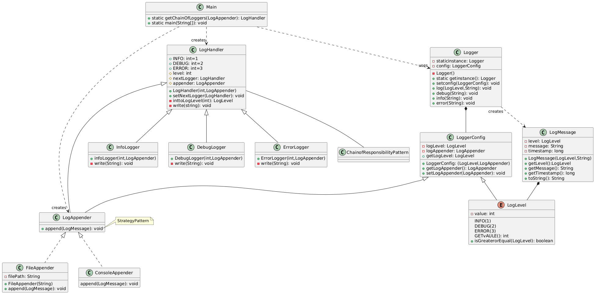

System Requirements
Supports the standard log levels (DEBUG, INFO, WARNING, ERROR, FATAL)

• Log messages with timestamp, level, and content

• Multiple output destinations (console, file, database)

• Configuration mechanism for log level and output destination

• Extensibility for new log levels and output destinations

                               +----------------+
                               |  Application   |
                               |  Generates Log  |
                               +----------------+
                                        |
                                        |
                                        v
                               +----------------+
                               |  Logger        |
                               |  Captures Log   |
                               |  Checks Logging  |
                               |  Level & Filters |
                               +----------------+
                                        |
                                        |
                                        v
                               +----------------+
                               |  Formatter     |
                               |  Formats Log    |
                               +----------------+
                                        |
                                        |
                                        v
                               +----------------+
                               |  Handler       |
                               |  (Console, File,  |
                               |  Network)        |
                               +----------------+
                                        |
                                        |
                                        v
                               +----------------+
                               |  Destination    |
                               |  (Console, File,  |
                               |  Database)       |
                               +----------------+

